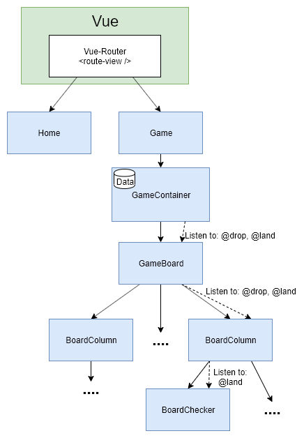

# HYU Connect Four Frontend

**This reposiroty followed the linked tutorial to have a simple working Connect  Four game. It was then extend to meet the requirements of the university project.**

- [Connect-Four tutorial](https://rossta.net/blog/series/connect-four.html) 
- [University project](https://github.com/Ribodou/HYU-software-engineering-AI)

# Overview of the design



# Instlallation & Usage
## Project setup
```
yarn install
```

### Configure the environment variables
Update the `VUE_APP_BACKEND_URL` variable to the backend endpoint
```
nano .env
```

### Compiles and hot-reloads for development
```
yarn run serve
```

### Compiles and minifies for production
```
yarn run build
```

### Customize configuration
See [Configuration Reference](https://cli.vuejs.org/config/).
